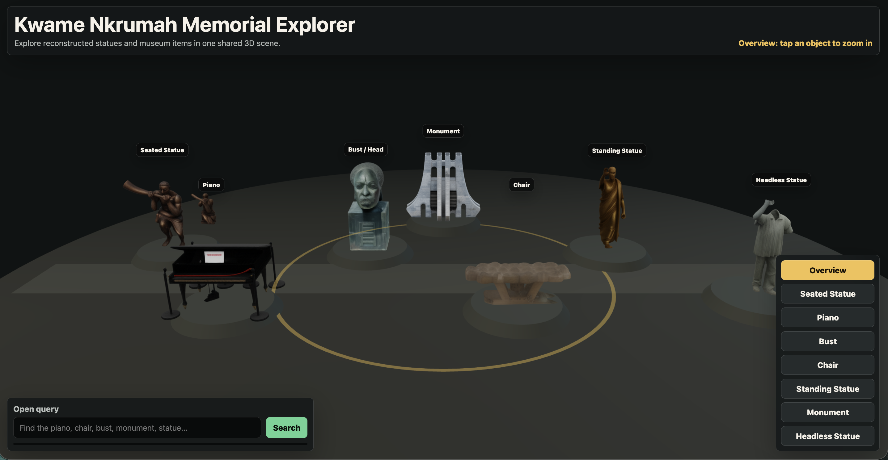

# Kwame Nkrumah Memorial Explorer

An interactive 3D web explorer for reconstructed objects from the Kwame Nkrumah Memorial Museum. The project places Gaussian-splat `.ply` reconstructions into one shared virtual memorial scene, lets visitors click/tap objects for historical context, and supports open text queries that zoom to the closest matching item.

## Screenshot

Add your screenshot here:

```md

```

Create a `screenshots/` folder, save your image as `explorer.png`, then uncomment or paste the Markdown image line above into this section.

## Features

- Shared 3D museum scene with multiple reconstructed objects.
- Gaussian splat rendering for `.ply` reconstructions using Spark and Three.js.
- Click/tap object selection with smooth camera zoom.
- Overview mode to return to the full memorial scene.
- Floating object labels and tour buttons.
- Historical information panel with source links.
- Open query search powered by SigLIP image-text matching, with a text fallback when the model is unsure.

## Objects Included

- Seated Statue
- Piano
- Bust / Head
- Chair
- Standing Statue
- Monument
- Headless Statue

## Tech Stack

- HTML, CSS, JavaScript
- Three.js
- Spark Gaussian splat renderer
- Transformers.js
- SigLIP zero-shot image-text matching

## Run Locally

From the project folder:

```bash
cd /Users/bethtassew/Desktop/sam3D
python3 -m http.server 5174
```

Open:

```text
http://localhost:5174/
```

If that port is busy:

```bash
python3 -m http.server 5175
```

Then open:

```text
http://localhost:5175/
```

Use `Cmd + Shift + R` in the browser after code changes so the latest JavaScript loads.

## Querying

The search box uses SigLIP through Transformers.js. The app renders each reconstruction, captures it as an image, compares the image against the search text, then selects the object with the strongest image-text match.

Examples to try:

- `piano`
- `chair`
- `stool`
- `monument`
- `mausoleum`
- `head`
- `headless statue`

If SigLIP returns very weak scores, the app falls back to metadata search using object names, aliases, file names, and historical descriptions.

## Project Structure

```text
.
├── index.html
├── style.css
├── app.js
├── water_sitted.ply
├── piano.ply
├── monument.ply
├── head.ply
├── chair.ply
├── forward.ply
├── headless.ply
└── README.md
```

## Deployment

This is a static web app, so it can be deployed with GitHub Pages, Netlify, Vercel, or any static host.

For GitHub Pages:

1. Push the project to GitHub.
2. Go to the repository settings.
3. Open **Pages**.
4. Set source to `Deploy from a branch`.
5. Choose branch `main` and folder `/root`.
6. Save and wait for GitHub to publish the site.

## Notes

The `.ply` files are Gaussian-splat reconstructions, not ordinary mesh models. The app renders them with a Gaussian splat renderer rather than a standard mesh loader.

If a `.ply` file is too large for GitHub, use Git LFS:

```bash
git lfs install
git lfs track "*.ply"
git add .gitattributes
git add .
git commit -m "Track PLY reconstructions with Git LFS"
```

## Credits

Historical descriptions are based on public information from:

- Google Arts & Culture: Kwame Nkrumah Memorial Park
- Kwame Nkrumah Memorial Park official site
- Visit Ghana
